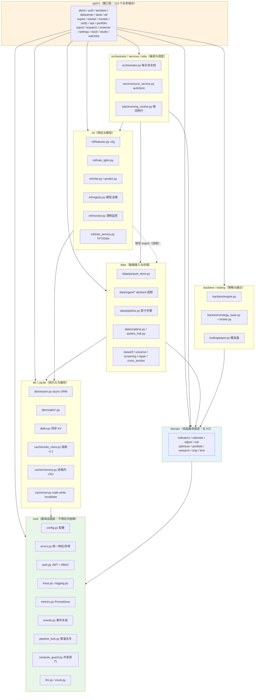

# AQP 后端架构与代码合理性审查

> 审查人：高见远（架构师）｜日期：2026-09-14｜范围：`backend/app/**`（122 个 Python 文件 / 28,902 行）+ `backend/scripts/**`
> 性质：**只读审查**（未修改任何业务源码；仅做只读导入与数据读取验证）
> 环境：Python venv `backend/.venv`，SQLite `data/sqlite/aqp.db`，Redis `aqp-redis`(healthy)，生产模型 `lgbm_v1/20260905_181713_repaired`（valid RankIC 0.102 / test RankIC 0.0705）

---

## 1. 架构总览

### 1.1 分层与依赖方向

### 1.2 依赖健康度判定

| 检查项 | 结论 | 依据 |
|---|---|---|
| `core` 反向依赖 api/ml/data/jobs/trading | ✅ 健康 | 全量 AST 扫描 `app/core/*.py`：0 处违规（仓库内 `tests/test_no_core_reverse_deps.py` 守卫有效） |
| `domain` 层纯度 | ✅ 健康 | `app/domain/*.py` 仅有 domain 内部互相 import，无 I/O、无 ORM、无配置读取（纯函数） |
| `data` ⇄ `ml` 循环 | ⚠️ 基本健康但残留 | 编排已上移 `orchestrator.py` 打破环；但 `ml/infer.py:105`、`ml/monitor.py:340`、`ml/predict.py:95` 仍有 3 处**函数级惰性 import** `app.data.parquet_store`，守卫测试 `test_no_data_to_ml_import.py` 只挡了 data→ml 一个方向，未挡 ml→data |
| `api` 层越层调用 | ✅ 健康 | api 只依赖 services/orchestrator/ml/data/domain，无反向引用 |
| 循环 import（运行时） | ✅ 无 | `from app.main import app` 导入成功，122 条路由全部注册 |
| 模块挂载完整性 | ✅ 无孤儿路由模块 | `router.py` 注册的 19 个模块与 `api/v1/*.py` 文件一一对应，无未注册模块 |

**结论：分层设计是健康且刻意的**（`core` 单向底部、`domain` 纯函数、`orchestrator` 作为唯一允许同时依赖 data+ml 的编排层）。遗留问题集中在"惰性 import 绕过层级"与"同一份数据被多处各写各的读取路径"（见 P0-1 / P0-3）。

---

## 2. 路由 / 能力清单

共 **113 个业务端点**（+ 9 个根/文档/监控端点 = FastAPI 实际注册 122 条）。下表按模块汇总，鉴权列取该模块内**最低**要求（写端点普遍更高）。

| 模块 | 前缀 | 端点数 | 最低鉴权 | 职责 |
|---|---|---|---|---|
| auth | `/api/v1/auth` | 4 | 无（3）/ viewer（1） | 登录 / 自助注册 / 注册开关 / me |
| market | `/api/v1/market` | 5 | ⚠️ 无（4）/ viewer（1） | 指数 K 线、批量行情、概览 rt/daily/聚合 |
| datacenter | `/api/v1/datacenter` | 22 | viewer / researcher | 数据总览、质量、同步（含自定义抓取）、镜像、文本因子、**训练启停** |
| research | `/api/v1/research` | 11 | researcher | IC/ICIR、因子相关、分位、实验、CV 折、特征重要性、组合优化、冲击成本、压力测试、年度实验室 |
| studio | `/api/v1/studio` | 9 | viewer / researcher | GP 因子挖掘、NL-to-Factor、Alpha 评估、因子 CRUD、因子报告 |
| desk | `/api/v1/desk` | 12 | researcher | 模拟盘：kill-switch、排除池、下单、撮合、账户、容量、归因 |
| settings | `/api/v1/settings` | 8 | viewer / researcher / admin | 偏好、引擎、连接测试、**API Key 轮换**、数据同步、清缓存、**DB 备份** |
| etf | `/api/v1/etf` | 7 | viewer | ETF 总览/列表/热门/业绩/规模/资金流/详情 |
| stock | `/api/v1/stock` | 5 | viewer / researcher | 搜索、档案、K 线、ML 预测、详情面板 |
| ops | `/api/v1/ops` | 4 | researcher | 质量扫描、血缘、DAG、**DAG 重跑** |
| alerts | `/api/v1/alerts` | 7 | viewer / researcher | 预警规则 CRUD、事件、已读、健康状态 |
| screener | `/api/v1/screener` | 3 | viewer | 选股榜、自选快照、全市场股票列表 |
| backtest | `/api/v1/backtest` | 3 | researcher | Top-K 回测、策略回测、信号分析 |
| export | `/api/v1/export` | 3 | researcher | 选股/回测/策略回测 xlsx 导出 |
| portfolio | `/api/v1/portfolio` | 2 | viewer / researcher | 组合回测、标的搜索 |
| report | `/api/v1/report` | 2 | viewer / researcher | AI 日报读取 / 生成 |
| monitor | `/api/v1/monitor` | 2 | viewer / researcher | ML 健康度、手动跑监控 |
| notify | `/api/v1/notify` | 2 | viewer | SSE 事件流、最近事件 |
| watchlist | `/api/v1/watchlist` | 2 | viewer | 自选看板、相关性矩阵 |

### 2.1 无鉴权端点（8 个）

| 方法 | 路径 | 判定 |
|---|---|---|
| POST | `/api/v1/auth/login` | ✅ 合理（登录入口） |
| GET | `/api/v1/auth/register/status` | ✅ 合理 |
| POST | `/api/v1/auth/register` | ✅ 合理（受 `ALLOW_REGISTRATION` 开关约束） |
| GET | `/api/v1/market/index/kline` | ⚠️ 低风险（白名单指数） |
| GET | `/api/v1/market/overview/rt` | ⚠️ 不一致 |
| GET | `/api/v1/market/overview/daily` | ⚠️ 不一致 |
| GET | `/api/v1/market/overview` | ❌ **不一致：返回 AI 推荐榜（核心信号）却免鉴权，而同类 `/market/quotes` 要求 viewer** |
| GET | `/api/v1/datacenter/train/readiness` | ⚠️ 应为 viewer（暴露数据规模/设备信息） |

### 2.2 死路由 / 未注册 / 重复实现

| 类型 | 位置 | 说明 |
|---|---|---|
| **功能死实现** | `app/api/v1/alerts.py:540` → `_evaluate_factor_quantile` | 路径 bug 导致恒返回 `[]`，规则永不触发（详见 P0-3） |
| **功能死实现** | `app/api/v1/app_settings.py:256` `/apikeys/rotate` | 生成的密钥无任何校验点，纯"假功能"（详见 P1-3） |
| **生产未接线模块** | `app/ml/features_v2.py`（157 行） | 仅 `tests/test_p2_rest.py` 引用；生产链路 0 引用（`features.py:42` 注释已自认"未接线的扩展实验"） |
| **生产未接线模块** | `app/data/ingest/multi_source.py`（153 行） | 全仓库仅 `tests/test_multi_source.py` 引用；宣称的"三源冗余"（P1-2）在生产零生效 |
| **职责重叠（可接受）** | `app/ml/predict.py`(164) vs `app/ml/infer.py`(111) | predict 是"单标的在线链路"薄壳（内部调用 infer 的 3 个原语），infer 是通用推理/批量原语。语义可区分，但建议注释固化为"predict=API 面向，infer=引擎面向" |
| **职责重叠（合理）** | `data/quotes_hub.py` vs `data/realtime.py` | quotes_hub 是带进程内 TTL 缓存的聚合层，内部调用 realtime 的 HTTP 原语；分层清晰，非重复 |
| **残留数据集** | `data/parquet/universe_daily_legacy` | 与 `universe_daily` 并存，疑为迁移残留 |
| **模型双份副本** | `data/models/prod/`(6) + `data/models/exp/`(11) | 同一 version 在两处各存一份；registry 的 `model_path` 指向 prod，但 `research.py` 读 exp（详见 P1-4） |

---

## 3. 问题清单

### P0 — 致命（数据错误 / 静默产出错误结果）

| # | 文件:行号 | 问题 | 影响 | 建议修法 |
|---|---|---|---|---|
| **P0-1** | `app/api/v1/research.py:87` `app/api/v1/studio.py:32` | 特征面板读取**不带版本号**：`(DATA_ROOT/"features").rglob("*.parquet")` 把 `version=alpha_basic_v1`（1,239,411 行，至 2026-09-04）与 `version=alpha_basic_v2g`（1,610,075 行，至 2026-09-14）**同时**读入并以 `diagonal_relaxed` 纵向拼接 | 实测：合计 2,849,486 行；近 380 交易日窗口内 **159,636 个 `(date,symbol)` 重复（占窗口行数 14.1%），同一标的同日有 v1 与 v2g 两套因子值**。 污染范围：`/research/overview`、`/factor-icir`、`/factor-corr`、`/factor-quantile`、`/lab/yearly`、`/feature-importance` 的边际效应、`/impact-sim`、`/stress-test`，以及 `/studio/*` 全部因子实验。**IC/分位/相关性全部是错的，且界面无任何异常提示** | ①改为 `DATA_ROOT/"features"/f"version={fv}"`，`fv` 取 `registry.get_production()["feature_version"]` 回退 `FEATURE_VERSION`； ②读取后加守卫 `assert df.unique(subset=["date","symbol"]).height == df.height`； ③顺带把 1.1GB 全量读入改为按年裁剪 |
| **P0-2** | `app/api/v1/datacenter.py:752-853` （对比 `sync_service.py:335-346`、`orchestrator.py:353`、`train_service.py:383`、`datacenter.py:966`） | `POST /datacenter/sync/fetch`（自定义抓取）的 worker `_run_fetch` **直接写 `daily_bar` / `daily_bar_hfq`，未申请 `pipeline_slot`**，与 sync / pipeline / mirror / training 四类任务无任何互斥 | `pipeline_lock.py:7-8` 自己写明：`atomic_write_parquet` 只保证单文件不写半截，**不保证两个写者之间的先后顺序**——并发抓取 + 晚间例行 `rebuild_qfq`/`build_features` 会互相静默覆盖，产出"看起来正常但错误"的行情与特征。这是 2026-09-12 审查 C-01 的回归缺口 | ①`_run_fetch` 整体包 `with pipeline_slot("fetch")`； ②把 `"fetch"` 加入 `core/pipeline_lock.TASKS`； ③`trigger_fetch` 启动前先 `current_pipeline_owner()` 预检并直接返回 40104 |
| **P0-3** | `app/api/v1/alerts.py:540` | `root = DATA_ROOT/"features"` 后 `root.glob("year=*.parquet")`——但磁盘真实布局是 `features/version=*/year=*.parquet`（非递归 glob 永远匹配不到） | `factor_quantile` 类型的预警规则**恒返回 `[]`，永不触发，且完全静默**。该文件为 score_topk 专门做了 `_mark_topk_health` 降级留痕，factor_quantile 这条路径却连留痕都没有，运维无从发现 | ①改为 `sorted((DATA_ROOT/"features"/f"version={FEATURE_VERSION}").glob("year=*.parquet"))` 取最后一个； ②`files` 为空时调用 `_mark_topk_health("features_missing", ...)` 留痕，与 score_topk 同标准； ③补一个"规则类型 × 本轮是否取到数据源"的守卫测试 |

### P1 — 功能不可用 / 明显不合理

| # | 文件:行号 | 问题 | 影响 | 建议修法 |
|---|---|---|---|---|
| **P1-1** | `app/main.py:127-132` | Prometheus 埋点用 `endpoint=request.url.path`（**原始路径**，含股票代码，如 `/api/v1/stock/600519.SH/predict`） | 标签基数 = 113 端点 × 2500 标的 ≈ **28 万+ 条时间序列**，长期运行必然打爆 Prometheus 内存；同时 `/metrics`（`main.py:173`）无任何鉴权，对外暴露内部路径清单 | 改用路由模板：`request.scope.get("route").path`（FastAPI 已提供 `/api/v1/stock/{symbol}/predict`）；`/metrics` 加 `require_role("viewer")` 或仅绑定 127.0.0.1 |
| **P1-2** | `app/api/v1/market.py:585/611/650` `app/api/v1/datacenter.py:990` | 4 个端点完全免鉴权（见 §2.1）。其中 `/market/overview` 返回 **AI 推荐榜单**（系统核心信号） | 鉴权口径不一致（同类 `/market/quotes` 要 viewer），未登录即可拉取推荐信号；`train/readiness` 暴露数据规模与硬件信息 | 统一挂 `require_role("viewer")`；若前端首屏确实要免登，应新增显式的"公开只读角色"并剥离 recommend 字段 |
| **P1-3** | `app/api/v1/app_settings.py:256-268` | API Key 轮换是**假功能**：`raw = "aqpx_"+token_urlsafe(24)` 只在响应里回一次，库里只存 `masked`；全仓库 grep `aqpx_` 仅出现在生成处，**没有任何地方校验该密钥** | 前端设置页展示一列表"已生成密钥"，但用户拿到的 key 永远无法通过任何 API 鉴权，属"看起来能用其实不能用"的伪功能 | 三选一：①真接入鉴权（存 hash，在 `require_auth` 里加一条 Bearer `aqpx_` 分支）；②下线该端点与前端入口；③至少在响应里明确标注"该密钥当前不用于接口鉴权" |
| **P1-4** | `app/api/v1/research.py:335` | 硬编码 `mdir = MODEL_ROOT/"exp"/f"lgbm_v1_{row[0]}"`，而 `model_registry.model_path` 记录的是 `models/prod/lgbm_v1_20260905_181713_repaired` | 与"registry 是模型唯一事实源"（`infer.load_prod_model` → `registry.load_prod_model`）脱钩。当前**仅因 exp 恰好存在同名副本才可用**；一旦 promote 一个只在 prod 的模型，`/research/feature-importance` 立即 404 报"模型文件缺失" | 直接读 `model_registry.model_path`（`Path(rec["model_path"]).parent`），与 `infer.load_prod_model` 共用同一个解析函数 |
| **P1-5** | `app/api/v1/alerts.py:486-488` `app/api/v1/alerts.py:545` | 在 `async def _evaluate_one` 内做**同步阻塞 I/O**：①`read_symbol_dataset("daily_bar", sym)`（逐标的 parquet 读，且在 for 循环里）；②`_evaluate_factor_quantile` 里 `pl.read_parquet(files[-1])`（整年特征分区，单文件 ~100MB+） | `alert_scheduler` 盘中**每 30 秒**跑一轮（`alerts.py:602`），每轮都可能把事件循环阻塞数百毫秒到数秒 → 同一进程内所有 API 请求（含 SSE 心跳）一起卡顿 | 两处均改为 `await asyncio.to_thread(...)`；`_evaluate_factor_quantile` 改为 `async` 并整体 to_thread；更进一步把整轮 `evaluate_rules` 放进 `to_thread`，或把调度周期放宽到 60s |
| **P1-6** | `app/api/v1/backtest.py:308-316`（`_load_strategy_bars`） `app/api/v1/watchlist.py:118-121` `app/data/panels.py:222-224` | 三套 `daily_bar`（raw 2499 / qfq 2458 / hfq 2500 只）覆盖不一致，且 qfq 缺失时**静默回退 raw** | 同一个回测/看板里不同标的可能用不同价格基准（前复权 vs 不复权），收益率、涨跌停闸门（`limit_up/limit_down` 由 close.shift 推导）随之失真；除权日附近尤其明显 | 回退必须**显式披露**：在响应里带 `price_basis` 字段并标 `degraded`；更彻底的做法是先跑 `rebuild_qfq` 再回测，或对缺失标的直接报错而非静默降级 |
| **P1-7** | `app/core/config.py:50 / 115 / 44` | 默认值不安全：`API_HOST="0.0.0.0"`、`ALLOW_REGISTRATION=True`、`ALLOW_ADMIN_TOKEN_LOGIN=True`；生产守卫（`get_settings:177-193`）**只在 `ENV=prod` 时触发**，而根目录 `.env` 未设 `ENV` → 当前实际为 `dev` | 一旦该服务被放到办公网/公网，任何人可自助注册账号并访问除 researcher 外的全部读端点 | `.env` 显式设 `ENV=dev` 并加注释；部署文档要求 `ENV=prod` + `ALLOW_REGISTRATION=false` + `ALLOW_ADMIN_TOKEN_LOGIN=false`；启动日志把 `API_HOST=0.0.0.0` 也纳入告警（当前只告警 ADMIN_TOKEN 默认值） |
| **P1-8** | `app/main.py:88-94` | `docs_url="/docs"` / `redoc_url="/redoc"` 硬编码常开，无环境判断 | 生产环境暴露全部 113 个端点的参数结构、枚举取值与错误码，显著降低攻击门槛 | 改为 `docs_url=None if s.ENV=="prod" else "/docs"`（`/openapi.json` 同理） |

### P2 — 改进建议

| # | 文件:行号 | 问题 | 建议 |
|---|---|---|---|
| P2-1 | `app/orchestrator.py:296` | `asyncio.get_event_loop().run_until_complete(_log_run())` 依赖调用方线程已 `set_event_loop`；若从无 loop 的线程/脚本调用会 RuntimeError | 改为 `asyncio.run(_log_run())`，或把 FeatureRun 落库上移到 async 调用方 |
| P2-2 | `app/orchestrator.py:371-372, 425` | 每次 `run_pipeline` 新建/关闭事件循环，导致 `db/session._get_engine()` 反复因 loop 变化重建引擎 | 改为复用 `asyncio.Runner` 或把 DB 写入统一交给 `asyncio.run` 隔离；至少加注释说明该副作用 |
| P2-3 | `data/models/prod`(6) + `data/models/exp`(11) | 同一 version 双份副本，含多个 `_monitor` / `_repaired` 历史版本 | 接入 `scripts/purge_legacy_models.py` 定时清理，保留 prod 全部 + exp 最近 N 个 |
| P2-4 | `data/parquet/universe_daily_legacy` | 与 `universe_daily` 并存的迁移残留数据集 | 确认无引用后归档删除 |
| P2-5 | `app/ml/features_v2.py`、`app/data/ingest/multi_source.py` | 生产零接线的实验代码，仅测试引用 | 要么接线，要么移到 `experimental/` 目录并在文档标注状态，避免误读为"已实现能力" |
| P2-6 | `app/core/compute_guard.py` + 用法 | `COMPUTE_CONCURRENCY=2` 只保护 5 处（backtest/desk/export/portfolio/research.optimize）；research 其余 10 个端点（每个都要加载 ~1.1GB 特征）无闸门 | 把 `compute_slot` 覆盖到 `/research/*` 全部重端点，或按端点加 TTL 结果缓存 |
| P2-7 | `app/cache/redis_client.py:225-228` | `ping()` 失败也调 `_mark_fail()` → 连续 5 次健康检查失败（如 Redis 短暂重启）即触发 60s 熔断，而健康检查本身可能是外部探测 | `ping()` 不计入熔断计数（另设独立计数器）；补半开探测（half-open）而非硬等 `OPEN_SECONDS` |
| P2-8 | `app/db/kv.py:35`、`app/api/v1/desk.py` | `sqlite3.connect()` 未设 `timeout=`（默认 5s）；evening routine / sync worker / train worker 多线程并发写 `app_state` 与 paper trading 表 | 统一 `sqlite3.connect(path, timeout=30)`，与 `session.py:63` 的 busy_timeout 对齐 |
| P2-9 | `app/api/v1/app_settings.py:37` | `_WRITE_LOCK = asyncio.Lock()` 在**模块导入期**创建，多事件循环（测试多次 `asyncio.run`）下会 RuntimeError "is bound to a different event loop" | 改为惰性创建（首次使用时 `get_running_loop()` 绑定）或 `functools.lru_cache` 按 loop 缓存 |
| P2-10 | `app/api/v1/stock.py:107/151/195/239` 等 | 路径参数 `symbol: str` 无 pattern 校验，`read_symbol_dataset` 直接拼 `symbol={symbol}` → 理论路径穿越 | 读侧仅能命中 `year=*.parquet`，写侧已被 `code_to_symbol`（6 位数字）挡住，风险有限；仍建议统一加 `pattern=r"^\d{6}\.(SH|SZ|BJ)$"` |
| P2-11 | `app/data/parquet_store.py:49-59` | `.manifest.json` 是"读优化缓存"，旁路写（repair 直写等）不感知，靠调用方手动 `manifest_invalidate()` | 把全部 parquet 写路径收敛到 `write_partition/write_year_batch/atomic_write_parquet`，并用守卫测试禁止旁路写（已有 `test_no_bypass_parquet_writes` 可扩展到 manifest 一致性） |
| P2-12 | `app/api/v1/auth.py:54-82` | 登录限流按**用户名**计数、进程级内存；`/register` 同理（5 次/小时/用户名） | 攻击者换用户名即可绕过；多实例部署失效。建议加 IP 维度 + 全局维度，生产迁 Redis |
| P2-13 | `app/core/errors.py` | **已整改**：`ERR_CREDENTIALS=40104` 保持登录兼容，`ERR_PIPELINE_BUSY=40900` 使用独立资源冲突码 | 前端按 40900 展示可重试提示且不清会话；契约测试固化两码不重复 |
| P2-14 | `app/data/etf.py:703` | `js.eval(hash_code)` 用 py_mini_racer 执行 akshare 内置 JS | 构成对第三方包的动态执行依赖；建议锁定 akshare 版本并对该 JS 做 checksum 校验 |
| P2-15 | `app/api/v1/notify.py:31` | SSE `/stream` 的 `symbols` 参数无长度上限，也无格式校验 | 加 `max_length` 与 symbol 格式校验，并对订阅总数设上限，防止单连接打爆行情抓取配额 |
| P2-16 | `app/ml/*:3 处惰性 import data` | `ml/infer.py:105`、`ml/monitor.py:340`、`ml/predict.py:95` 从 ml 反向 import data | 与"data ⇄ ml 不得互相依赖"的架构约定冲突；建议把 parquet 读写作为参数注入，或把这三个函数上移到 `orchestrator`/`services` 层 |

---

## 4. 专项核查结论（未发现问题项）

以下为本次重点排查但**结论为健康**的项，供交叉验证：

| 核查项 | 结论 |
|---|---|
| ML 三段切分与防泄漏 | ✅ `train_lgbm.split_dates` 严格 train｜gap｜valid｜gap｜test，`gap_days = horizon`；特征筛选只用 train 段（`select_features_by_ic` 仅传 `train_mask`）；`close` / `label_ret` 显式排除出特征集（防标签泄漏）；test 段只在最终 `_eval` 出镜 |
| 特征 asof 稳定性 | ✅ 特征基于 `daily_bar_hfq`（后复权，IPO 累计口径），`orchestrator.step_build_features` 有"预热窗尾部 60 日重叠段逐值比对"的一致性守卫，不一致自动回退全量（`tests/test_feature_asof.py` / `test_feature_incremental.py`） |
| 生产模型治理 | ✅ `registry.load_prod_model` 只读 `is_production=1`，无生产模型直接抛错、**绝不回退实验模型**；校验 `.lgbm` 后缀与 `features.json` 存在性（CRIT-003 已修） |
| 统一响应信封 | ✅ `register_error_handlers` 覆盖 `StarletteHTTPException` / `AQPException` / `RequestValidationError` / `Exception` 四类，全部转 HTTP 200 + `{code,message,data,trace_id,ts}`；`core/auth` 的 200+detail 也有映射表。**未发现裸 500 或吞异常**（异常只降级到业务码） |
| trace_id 贯通 | ✅ 中间件绑定 contextvar → 响应体 + `X-Trace-Id` 头 + loguru 三者同源；query 串对 `token/password/secret/key/authorization` 脱敏后再进日志 |
| `core` 反向依赖 | ✅ 0 违规（见 §1.2） |
| Redis 熔断 + SWR + LRU | ✅ 三层降级（总开关/超时/熔断）齐全，写操作永远双写 LRU，SWR 影子键与 `delete` 双删配套；`try_lock` 有进程内时间戳兜底 |
| 缓存 key 维度 | ✅ `k_stock_kline` 含 adjust+区间、`k_market_overview` 含 recommend_k、`k_screener` 含 date+strategy+top_k+board、`k_backtest` 由调用方拼全参；注释里还留了历次漏参事故的前科说明 |
| 大部分阻塞调用 | ✅ 147 个 async 端点中，`to_thread` 使用广泛（backtest/research/desk/etf/datacenter/settings 均已包裹）；未包裹的集中在 alerts 调度（见 P1-5） |
| 管道互斥 | ✅ `pipeline_lock` 覆盖 sync / pipeline / mirror / training 四类，**唯独 fetch 漏网**（见 P0-2） |
| 原子写 | ✅ `tmp → fsync(O_RDWR) → os.replace`，统一 zstd-7，异常清理 tmp |
| SQLite WAL | ✅ `journal_mode=WAL` + `synchronous=NORMAL` + `busy_timeout=30s` + `foreign_keys=ON`，异步引擎 `check_same_thread=False`，跨事件循环自动重建 |
| 命令注入 | ✅ 全仓库无 `subprocess` / `os.system` / `os.popen`；Alpha 表达式用 AST 白名单（`alpha_expr.py` 无 eval/exec） |
| 数据抓取路径穿越 | ✅ `code_to_symbol` 强校验 6 位数字，`fetch` 写路径安全 |

---

## 5. 结论

### 5.1 一句话判定

> **后端整体「可用但不完全可信」**：工程底座（分层、统一响应、缓存降级、原子写、模型治理、ML 防泄漏、训练三段切分）达到相当高的水位，**代码质量明显高于同类毕设/原型项目**；但存在 **3 个 P0 级"静默错误"**——研究/因子实验室的指标建立在被两代特征空间污染的面板上、因子分位预警规则因路径 bug 永久失效、自定义抓取未纳入管道互斥可并发写坏行情——这三个问题**都不会报错、界面看起来完全正常**，是当前最危险的部分。修复这 3 项 + 8 项 P1 后，可判定为"可用 + 合理"。

### 5.2 最该先修的 5 件事（按优先级排序）

| 序 | 事项 | 级别 | 预估成本 | 理由 |
|---|---|---|---|---|
| **1** | **特征读取加版本号**：`research.py:87`、`studio.py:32` 改为 `features/version={生产 feature_version}`，并加"无重复 (date,symbol)"断言 | P0 | 0.5 天 | 污染面最大：研究页 8 个端点 + 因子实验室全部指标当前是错的，且用户完全无感 |
| **2** | **自定义抓取纳入管道互斥**：`_run_fetch` 包 `pipeline_slot("fetch")`，`"fetch"` 加入 `TASKS` | P0 | 0.5 天 | 数据正确性根因：并发写会让整个 `daily_bar` 数据集静默变脏，且污染不可逆（难以回溯哪天被覆盖） |
| **3** | **修复因子分位预警路径**：`alerts.py:540` 改为 `features/version=*/year=*.parquet` 并补降级留痕 | P0 | 0.5 天 | 功能完全不可用 + 完全静默；顺手把 `alerts` 的两处同步 I/O 改成 `to_thread`，一并解决事件循环周期卡顿（P1-5） |
| **4** | **Prometheus 标签改用路由模板 + `/metrics` 加鉴权** | P1 | 0.5 天 | 28 万+ 时间序列会直接打挂 Prometheus，属于"上线即事故"型问题，且修法只有两行 |
| **5** | **统一鉴权口径 + 处理两个伪功能**：`/market/overview*` 与 `train/readiness` 挂 viewer；`/apikeys/rotate` 明确下线或真接入；`feature-importance` 改读 registry 的 `model_path` | P1 | 1 天 | 消除"看起来能用其实不能用"的伪功能（API Key）与"侥幸能用"的隐性耦合（exp/prod 双份模型），是"功能是否真的可用"这条主线的关键收口 |

> 其余 P2 项建议排入下一个迭代，其中 **P2-5（清理 features_v2 / multi_source 死代码）** 与 **P2-3（清理模型双份副本）** 对"项目是否整洁可信"的观感影响最直接，可顺手做掉。
