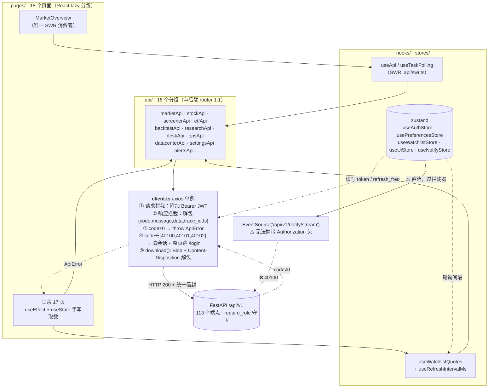

# AQP 前端架构与前后端契约一致性审查

- 审查人：高见远（架构师）
- 日期：2026-09-14
- 范围：`frontend/src/**`（18 个页面目录，105 个 `.ts/.tsx`，18,246 行）
- 性质：**只读审查**，未修改任何源码
- 辅助验证：`npx tsc --noEmit` → **0 error**（strict 模式全绿）

---

## 1. 前端架构总览

### 1.1 目录职责

| 目录 | 文件数 | 行数 | 职责 | 评价 |
|---|---:|---:|---|---|
| `src/api/` | 18 | ~1,500 | 按后端 router 1:1 分组的端点封装 + `client.ts`（axios 实例/拦截/解包）+ `swr.ts`（SWR 基建） | ✅ 分组与后端 `app/api/v1/*.py` 严格对应，命名一致 |
| `src/types/` | 7 | ~1,150 | 与后端 Pydantic/dict 键一一对应的 TS 接口 | ✅ snake_case 全局统一，无 camelCase 混用 |
| `src/stores/` | 5 | ~200 | zustand：auth / preferences / ui / watchlist / notify | ✅ 边界清晰（见 1.3） |
| `src/hooks/` | 3 | ~90 | 轮询与共享数据源 | ⚠️ 仅 2 个页面消费 |
| `src/components/` | 8 | ~1,600 | 布局（Sidebar/Topbar）、守卫（AuthBootstrap/RequireAuth）、图表（KLineChart/MarketHeatmap）、ErrorBoundary | ✅ |
| `src/components/ui/` | 1 | 338 | Card / SectionCard / MetricCard / LoadingState / PanelEmpty / Modal 等通用件 | ✅ 复用良好 |
| `src/pages/` | 18 目录 | ~13,000 | 页面，大页已拆 `parts.tsx` | ⚠️ 3 个文件 >700 行 |
| `src/utils/` | 2 | ~90 | `format.ts`（金额/百分比口径集中）、`useChart.ts`（ECharts 生命周期） | ✅ |
| `src/lib/` | 1 | — | `echarts.ts` 按需注册，避免全量引入 | ✅ |

### 1.2 数据流图

### 1.3 状态管理边界（zustand 5 个 store）

| store | 持久化 | 是否应持久化 | 评价 |
|---|---|---|---|
| `useAuthStore` | ✅ localStorage `aqp-auth` | 是 | ✅ 含 `expiresAt` 本地预判 + legacy `AQP_ADMIN_TOKEN` 迁移；真实校验在后端 |
| `useUiStore` | ✅ `aqp-ui` | 是 | ✅ 复权/周期/回看天数偏好 |
| `useWatchlistStore` | ✅ | 是 | ✅ 自选分组（纯本地，后端无对应表） |
| `usePreferencesStore` | ❌ 内存 | 否（服务端为准） | ✅ 由 `AuthBootstrap` 登录后从 `/settings` 预载，正确 |
| `useNotifyStore` | ❌ 内存 | 否 | ⚠️ 模块级 EventSource 单例，`open()` 幂等但**无 `close()`**，登出后仍保持连接 |

**结论**：store 划分合理——「会话」「UI 偏好」「自选」「服务端偏好」「推送」五类关注点没有互相污染，唯一越界是 `useNotifyStore` 持有无法关闭的全局连接。

---

## 2. 前后端契约核对表

### 2.1 汇总

| 项 | 数量 |
|---|---:|
| 后端定义端点（`app/api/v1/*.py`，含 `/api/v1` 前缀） | **113** |
| 前端调用端点（含路径参数模板 + `EventSource`） | **112** |
| ✅ 方法 + 路径 + 参数 + 返回类型完全一致 | **107** |
| ❌ 前端调用但后端不存在（必然 404） | **0** |
| ⚠️ 字段/类型不匹配（抽查 12 个高频接口） | **0** |
| ⚠️ 后端有但前端未使用（能力浪费 / 死代码） | **5** |
| — 其中：前端 `api/*.ts` 已定义但 0 调用 | 4 |
| — 其中：前端完全未定义 | 1 |

> **结论：契约层面质量很高。** 全项目 113 个端点无一条 404，字段命名（snake_case / `dir` 别名 / `date`→`day` 别名 / `top_n` 等）逐一对齐，说明 api 层是"照着后端写"的。问题不在契约，而在**鉴权与并发策略**。

### 2.2 逐模块核对（✅ = 方法/路径/参数/返回类型一致）

| 前端文件 | 端点 | 后端文件 | 状态 |
|---|---|---|---|
| `api/auth.ts` | `POST /auth/login`、`POST /auth/register`、`GET /auth/register/status`、`GET /auth/me` | `v1/auth.py:102,175,162,217` | ✅ |
| `api/market.ts` | `GET /market/overview`、`/overview/rt`、`/overview/daily`、`/index/kline`、`/quotes` | `v1/market.py:649,585,610,500,531` | ✅ |
| `api/stock.ts` | `GET /stock/search`、`/{symbol}/profile`、`/kline`、`/predict`、`/panels` | `v1/stock.py:78,107,150,194,238` | ✅ |
| `api/screener.ts` | `GET /screener`、`/screener/stocks`、`/screener/watchlist` | `v1/screener.py:246,360,230` | ✅（`dir`/`basis`/`refresh` 与后端 `sort_dir` alias 一致） |
| `api/etf.ts` | `overview / list / hot / performance / scale / flow / detail/{code}` | `v1/etf.py:176,183,232,248,294,346,586` | ✅ |
| `api/backtest.ts` | `POST /backtest/run`、`POST /backtest/signal-analysis` | `v1/backtest.py:257,690` | ✅ |
| `api/strategyBacktest.ts` | `POST /backtest/strategy-run` | `v1/backtest.py:635` | ✅ |
| `api/research.ts` | `overview / factor-icir / factor-corr / factor-quantile / lab/yearly / experiments / cv-folds / feature-importance / optimize / impact-sim / stress-test`（11 个） | `v1/research.py:120,170,197,218,559,234,290,320,383,462,514` | ✅ |
| `api/portfolio.ts` | `GET /portfolio/search`、`POST /portfolio/backtest` | `v1/portfolio.py:140,110` | ✅ |
| `api/watchlist.ts` | `GET /watchlist/dashboard`、`/correlation` | `v1/watchlist.py:225,307` | ✅ |
| `api/production.ts` · studioApi | `mining/start`、`mining/status/{id}`、`mining/cancel/{id}`、`alpha-eval`、`factor-report`、`factors`(GET/POST/DELETE) | `v1/studio.py:66,90,115,242,410,297,319,380` | ✅ |
| `api/production.ts` · opsApi | `quality-scan`、`lineage`、`dag`、`dag/rerun` | `v1/ops.py:29,267,361,434` | ✅ |
| `api/production.ts` · deskApi | `kill-switch`(GET/POST)、`exclusion`(GET/POST)、`exclusion/toggle`、`exclusion/screen`、`orders`(GET/POST)、`fills/run`、`account`、`capacity`、`attribution`（12 个） | `v1/desk.py:52,72,89,111,142,157,178,197,210,245,260,297` | ✅ |
| `api/datacenter.ts`（22 个） | overview/datasets/quality/logs/task-stats/sync/sync·status/sync·tasks/{id}/sync·auto/sync·cancel/sync·fetch/instruments/text·*/mirror·*/train·* | `v1/datacenter.py`（22 处） | ✅ |
| `api/settings.ts`（8 个） | `GET /settings`、`PUT /settings/preferences`、`PUT /settings/engine`、`POST /connectors/test`、`/apikeys/rotate`、`/data/cache/clear`、`/db/backup`、`/data/sync` | `v1/app_settings.py:140,178,198,237,255,282,312,272` | ✅ |
| `api/export.ts` | `GET /export/screener`（`date`→后端 `day` alias）、`POST /export/backtest`、`POST /export/strategy-backtest` | `v1/export.py:17,51,72` | ✅ |
| `api/alerts.ts` | `rules`(GET/POST)、`rules/{id}`(PUT/DELETE)、`events`、`events/read` | `v1/alerts.py:118,133,162,195,217,242` | ✅ |
| `api/notify.ts` | `GET /notify/recent` | `v1/notify.py:102` | ✅ |
| `api/monitor.ts` | `GET /monitor/health`、`POST /monitor/run`、`GET /report/daily`、`POST /report/daily/generate`、`POST /studio/nl-to-factor` | `v1/monitor.py:19,34` + `v1/report.py:443,457` + `v1/studio.py:192` | ✅ |
| `stores/useNotifyStore.ts:34` | `GET /notify/stream`（SSE） | `v1/notify.py:31` | ⚠️ 路径一致但**鉴权不可用**（见 P0-3） |

### 2.3 后端有 / 前端未使用（能力浪费）

| 后端端点 | 角色 | 前端状态 | 影响 |
|---|---|---|---|
| `GET /api/v1/alerts/health` | researcher | **前端 `api/alerts.ts` 未定义** | 预警数据源健康度（predictions + universe 覆盖）无入口 |
| `GET /api/v1/market/overview` | 公开 | `marketApi.overview()` 已定义，**0 调用**（页面改用 rt + daily 分块） | 冗余端点；前端留死代码 |
| `GET /api/v1/market/quotes` | viewer | `marketApi.quotes()` 已定义，**0 调用** | 批量实时行情（≤200 只、15s 进程缓存）能力完全浪费 |
| `GET /api/v1/datacenter/sync/tasks/{task_id}` | researcher | `datacenterApi.task()` 已定义，**0 调用**（页面用 `/sync/status`） | 持久化任务查询无入口 |
| `PUT /api/v1/alerts/rules/{id}` | researcher | `alertsApi.updateRule()` 已定义，**0 调用** | **预警规则无法编辑**，只能删除重建（见 P1-5） |

### 2.4 类型字段一致性抽查

抽查了 12 个字段最多 / 最易漂移的响应体，逐键比对后端 `ok({...})` 的字典键：

| 类型 | 抽查字段 | 结果 |
|---|---|---|
| `types/p1.ts` · `StockListResult` | `total/page/page_size/trade_date/as_of/basis/basis_desc/basis_fields/source/degraded/quote_coverage/sort_applied/dir_applied/items/options/stale/from_cache` | ✅ 与 `screener.py:433+` 完全一致 |
| `types/p1.ts` · `StockListItem` | `symbol/name/industry/board/close/pct/amount/amount_yi/total_cap_yi/float_cap_yi/turnover/is_st/is_halted/quote_status` | ✅（并正确注释"禁止前端再 /1e8"） |
| `types/p1.ts` · `ScreenerResult.freshness` | `as_of/expected/lag_trading_days/is_stale/note` | ✅ |
| `types/watchlist.ts` · `WatchItem` | `symbol/code/type/name/close/pct/amount_yi/kline_state/alert/date/closes/pe/pb/source` | ✅ 与 `watchlist.py:252-283` 一致 |
| `types/watchlist.ts` · `WatchSummary` | `count/stock_count/etf_count/avg_pct/flow_total_yi/alert_count/alert_kinds/quote_date` | ✅ 与 `watchlist.py:293-302` 一致 |
| `types/api.ts` · `APIResponse` | `code/message/data/trace_id/ts` | ✅ 与 `core/errors.py:43-54` 一致 |
| `types/stock.ts` · `OverviewRt` / `OverviewDaily` | `trade_date/as_of/indices/money_flow/anomalies/heat/sectors/recommend/ai_stats/sentiment/pred_dates/from_cache/stale/refreshed_recently` | ✅ |
| `types/etf.ts` · `EtfListResult` | `total/page/page_size/items/options/sort_applied/dir_applied` | ✅ |
| `api/production.ts` · `LineageGraph` | 18 个可选键 + `topology_source/node_states_scanned/generated_at/missing_nodes` | ✅ |
| `api/datacenter.ts` · `TrainStatus` / `TrainReadiness` | 与 `datacenter.py` 训练系列一致 | ✅ |
| `api/monitor.ts` · `MonitorSnapshot` | `state/ic_state/drift_state/psi/ks/half_life/retrain/state_log/...` | ✅ |

**没有发现 snake_case / camelCase 混用**，也没有发现前端多写/少写字段导致的静默 `undefined`。

---

## 3. 鉴权矩阵（前端路由守卫 vs 后端真实要求）

后端只有 5 个端点真正公开：`/market/overview`、`/market/overview/rt`、`/market/overview/daily`、`/market/index/kline`、`/auth/*`。**其余 108 个端点全部要求 `viewer` 以上。**

| 路由 | 页面主接口的最低角色 | 前端守卫 | 结论 |
|---|---|---|---|
| `/` 市场概览 | 公开 | 无 | ✅ 设计如此 |
| `/login` | 公开 | — | ✅ |
| `/settings` | viewer | `RequireAuth` | ✅ |
| `/studio` `/dataquality` `/desk` `/pipeline` `/capacity` | researcher | `RequireRole` | ✅ 与后端一致 |
| `/screener` | viewer（+`screener/watchlist` viewer） | **无** | ⚠️ 匿名/过期 → 401 → 整页踢走 |
| `/stock/:symbol` | profile/panels/kline **viewer**；predict **researcher** | **无** | ⚠️ 深链匿名不可用；viewer 必现 403 |
| `/etf` `/etf/:code` | viewer | **无** | ⚠️ 同上 |
| `/watchlist` | viewer | **无** | ⚠️ 同上 |
| `/alerts` | **researcher** | **无** | ⚠️ viewer 满屏 40300 |
| `/research` | **researcher** | **无** | ⚠️ viewer 满屏 40300 |
| `/backtest` | **researcher** | **无** | ⚠️ viewer 满屏 40300 |
| `/portfolio` | search viewer / backtest **researcher** | **无** | ⚠️ |
| `/report` | daily viewer / generate **researcher** | **无** | ⚠️ |
| `/data` | 混合 viewer+researcher | **无** | ⚠️ |

**18 条路由只有 6 条带守卫，12 条裸奔。** 前端"页面能打开"与"接口能调通"严重脱节。

> 说明：前端守卫（`RequireAuth`/`RequireRole`）只是**体验层**，真正的边界在后端 `require_role`，篡改 localStorage 无法拿到数据——这一点实现是正确的，不存在"假鉴权绕过"。问题在于**前端守卫覆盖率不足 + 401 兜底方式是整页刷新**。

---

## 4. 问题清单

### P0 — 功能不可用 / 白屏 / 体验崩塌

#### P0-1 全局拦截器无条件整页跳转，导致唯一公开的首页也无法匿名访问

- **位置**：`api/client.ts:26-32`（`handleAuthFailure`）、`api/client.ts:74-82`；触发点 `components/Topbar.tsx:80` → `stores/useNotifyStore.ts:31`
- **问题**：Topbar 在**每个非登录页**挂载时无条件 `openNotify()`，首请求 `GET /notify/recent` 需 `viewer`。匿名访问 → 40100 → 拦截器调 `window.location.href = '/login?next=...'`，**整页刷新**。
  市场概览的 `rt`/`daily` 本身是公开端点，但因为顶栏一个后台探测请求，用户在首页停留 <1s 就被踢走。
- **影响**：
  1. 与 `pages/Login/index.tsx:199-200` 明示的"行情、选股等只读页面无需登录"直接矛盾；
  2. 与后端把 market/overview 系列设为公开的设计矛盾；
  3. 整页刷新丢失所有 SPA 状态；`Promise.all` 中任一请求 401 都会打断同批其他请求。
- **建议**：
  1. 拦截器只 `clear()`，**不做跳转**；跳转交给路由守卫（`RequireAuth`）统一处理；
  2. `Topbar` 改为 `if (authed) openNotify();`，未登录不建 SSE、不拉 recent；
  3. 若坚持"全站必须登录"，则给 App 加一个 `<RequireAuth>` 包裹所有业务路由，并在文案上纠正，不要靠 401 兜底。

#### P0-2 策略研究页首屏 11 个并发重计算 POST，撞后端并发闸门，`Promise.all` 整体失败 → 整页空白

- **位置**：`pages/Research/index.tsx:87-101`（`Promise.all`，**非** `allSettled`）
- **后端事实**：`backend/app/core/compute_guard.py:10-16` —— `BoundedSemaphore(COMPUTE_CONCURRENCY)`，`acquire(blocking=False)`，**不排队、直接抛 `ERR_RATE_LIMITED(40103) "计算资源繁忙，请稍后重试"`**；`app/core/config.py:100-103` 默认 **2，上限 2**。
- **问题**：首屏 11 个请求中 **7 个**带 `compute_slot`（factor-icir / factor-corr / factor-quantile / cv-folds / optimize / impact-sim / stress-test）。并发上限 2 ⇒ 至少 5 个立刻 40103 ⇒ `Promise.all` 首个 reject 即抛 ⇒ `catch` 只 `setErr(...)`，**`setOverview/setIcirRows/setCorr/...` 全部不执行**，四象限全部空白，只显示一行错误。
- **影响**：策略研究页在正常负载下**大概率完全不可用**（不是偶发，是并发数决定）。
- **建议**：
  1. `Promise.all` → `Promise.allSettled`，逐面板成功/失败独立渲染（与 `DataCenter:401`、`StockDetail:54` 的做法对齐）；
  2. 首屏只拉轻量的 `overview/experiments/lab-yearly/feature-importance`，重计算面板改**按需触发**（点"计算"按钮）或串行队列（最多 2 并发）；
  3. 捕获 `code === 40103` 时展示"计算繁忙，请稍后重试"并给重试按钮，而不是笼统的"研究服务暂不可用"。

#### P0-3 通知中心 SSE 100% 连接失败（EventSource 无法携带 Authorization）

- **位置**：`stores/useNotifyStore.ts:34`；后端 `v1/notify.py:31,39`（`require_role("viewer")`）、`core/auth.py:107-118`（`HTTPBearer`，只认 header）
- **问题**：`new EventSource('/api/v1/notify/stream')` 不能设置请求头。后端返回 HTTP 200 + `{"code":40100,...}`（content-type `application/json`），浏览器 EventSource 因 MIME 不是 `text/event-stream` 直接 `onerror`，**不会收到任何消息**。
- **影响**：铃铛永远显示"连接中…"（`Topbar.tsx:222,237`），实时推送（同步/挖掘/预警）**从未工作过**；只能靠 `open()` 里那一次 `/notify/recent` 回放，且之后再不刷新。
- **建议**：二选一 —— ① 后端为 `/notify/stream` 增加**短期一次性 ticket**（`GET /notify/ticket` → `?ticket=xxx`，服务端校验后放行）；② 前端改用 `fetch` + `Authorization` 头 + `ReadableStream` 手动解析 SSE。同时 `useNotifyStore` 应提供 `close()` 并在 `clear()` 时断开。

---

### P1 — 明显不合理 / 体验破损

| # | 位置 | 问题 | 影响 | 建议 |
|---|---|---|---|---|
| P1-1 | `App.tsx:85-111` | 18 条路由仅 6 条带守卫（见 §3 鉴权矩阵） | viewer 进 `/research` `/backtest` `/alerts` 满屏 40300；匿名进 `/screener` `/stock/:symbol` `/etf` `/watchlist` 被整页踢走 | 给 12 条裸奔路由按后端最低角色补 `RequireAuth` / `RequireRole`，让"需要登录"在前端显式声明 |
| P1-2 | `pages/StockDetail/index.tsx:54-59` + `v1/stock.py:194` | `/stock/{symbol}/predict` 需 **researcher**，但个股页无守卫 | viewer 打开任何个股页，AI 预测块恒 403；且 profile/panels/kline 需 viewer ⇒ 匿名深链 `/stock/600519.SH` 完全不可用 | 个股页补 `RequireAuth`；predict 失败时降级为"预测需研究员权限"提示而非错误条 |
| P1-3 | `pages/Settings/index.tsx:227-241` | `saveAll` 把 `savePreferences`(viewer) 与 `saveEngine`(**admin**) 放进 `Promise.all` | **viewer 保存个人偏好必然整体失败**，弹出"保存失败，请重试"——但偏好其实已写库，是假失败 | 拆成两个独立保存动作；`saveEngine` 仅 admin 可见/可提交（用 `user.role` 控制 UI） |
| P1-4 | `pages/Settings/index.tsx:259-271` | `runSync` 内 `setInterval` **无 cleanup**（仅在成功分支 `clearInterval`） | 离开设置页后仍每 1.5s 拉 `/datacenter/sync/status`，请求泄漏 + 卸载后 setState | 把 `poll` 存 `useRef`，在 `useEffect` 返回函数里 `clearInterval`；或改用 `useTaskPolling` |
| P1-5 | `api/alerts.ts:64-65` / `v1/alerts.py:162` | 后端 `PUT /alerts/rules/{id}` 已实现、前端 `updateRule` 已定义，但**页面 0 调用**（只有新建/删除） | 预警规则无法编辑（改阈值、启停、改冷却），只能删了重建 | 复用现有表单做"编辑模式"；同时接入 `GET /alerts/health` 展示数据源健康度 |
| P1-6 | `pages/DataQuality/index.tsx:115-118` | 挂载即自动 `opsApi.qualityScan({dataset:'daily_bar'})`（180s 超时的全量 QC 扫描） | 每次进页面都触发一次重任务，且会占用唯一的 `compute_slot`，容易把其他计算挤成 40103 | 改为默认只展示上次结果，扫描按钮手动触发 |
| P1-7 | `pages/MarketOverview/index.tsx:65-70` | `{...(daily.data as object), ...(rtData as object)} as unknown as MarketOverviewData` 双重断言，掩盖"两块数据可能只到一块"的事实 | 类型系统完全失效；`types/stock.ts:481-487` 注释自述"2026-09-13 由此引发首页 ErrorBoundary 白屏" | 定义 `Partial<OverviewRt> & Partial<OverviewDaily>` 视图类型，子组件用可选链；删掉 `as unknown as` |
| P1-8 | `components/RequireAuth.tsx:56` | `user` 由 `AuthBootstrap` **异步**加载，首帧 `user?.role` 为 `undefined` ⇒ `hasMinimumRole(undefined,'researcher') = false` | 刷新 `/studio` `/desk` 等页会闪一下"权限不足 · 当前为 未登录"，随后才正常 | 增加 `user === null && token 有效` 的"加载中"态（骨架/转圈），不要直接判失败 |
| P1-9 | `pages/DataCenter/index.tsx:441-457` | 同步任务轮询 1.5s，且**没有 `document.visibilityState` 守卫**（`Alerts:212`、`useWatchlistQuotes:68` 都有） | 后台标签页持续打后端；与项目内既定做法不一致 | 统一加可见性判断；并把 1.5s 放宽到 2~3s |

---

### P2 — 建议

| # | 位置 | 问题 | 建议 |
|---|---|---|---|
| P2-1 | `pages/Screener/index.tsx:137` | `useState<any>(null) // API 返回类型扩展中` —— 全项目唯一真 `any`，且 `ScreenerResult` 类型就在手边 | 改为 `useState<ScreenerResult \| null>(null)` |
| P2-2 | `pages/Etf/index.tsx:178` | `etfApi.list(p as never)` —— 用 `as never` 绕过参数类型检查 | `etfApi.list` 参数类型加索引签名，或直接传强类型对象 |
| P2-3 | `package.json:18` | `lightweight-charts@4.2.0` 依赖 **0 import**（全项目已统一到 ECharts） | 移除依赖 |
| P2-4 | `api/swr.ts:6-14` vs 实际 | 注释声明"页面应删除手写 setInterval，迁到 SWR"，但 18 页里**只有 MarketOverview 用 SWR**，`useApi`/`useTaskPolling` 各只有 1 个消费者 | 把 `Alerts`(30s)、`OrderDesk`、`DataCenter`(1.5s)、`Watchlist` 迁移到 SWR/useTaskPolling，统一缓存与重试语义 |
| P2-5 | `pages/OrderDesk/index.tsx:79-84` | 默认 10s 并发 4 个接口（`account/orders/killSwitch/exclusion`），无可见性守卫 | 加 `visibilityState`；非活跃时段降到 30s |
| P2-6 | `types/api.ts:19-29` | `ERR` 常量缺 40101/40102/40103/40104/40105-40107/53000/53001，与 `core/errors.py` 已不同步 | 补齐；`ApiError.code` 已有，页面可据 code 分流（如 40103 提示"计算繁忙"） |
| P2-7 | `pages/Settings/index.tsx` | admin 专属操作（轮换密钥/清缓存/备份 DB/引擎配置）对 viewer 一律可点，点了只弹通用失败 | 用 `user.role` 禁用并 tooltip 说明所需角色 |
| P2-8 | `v1/export.py:22` | `/export/screener` 需 researcher，选股页导出按钮对所有人可见 | 前端按角色禁用导出入口（`download()` 已正确处理 JSON 错误信封，这点做得好） |
| P2-9 | 文件体积 | `DataCenter/index.tsx` 902 行、`KLineChart.tsx` 752 行、`Screener/index.tsx` 738 行、`StockDetail/index.tsx` 700 行、`EtfDetail/index.tsx` 694 行、`Settings/index.tsx` 693 行 | 优先拆 `DataCenter`（TrainPanel/TextDataPanel 已拆，仍可再拆"质量表 + 日志 + 同步控制台"三块）与 `Settings`（偏好/引擎/密钥/运维四块） |
| P2-10 | `pages/Settings/index.tsx:167-171` | `notify()` 的 `setTimeout` 未在卸载时清理 | 存 ref + `useEffect` cleanup |
| P2-11 | `hooks/useRefreshInterval.ts` | 文件名 `useRefreshInterval` 但导出 `useRefreshIntervalMs`；`usePreferencesStore.ts:42` 的 `getRefreshIntervalMs()` **0 调用** | 统一命名；删除无用的 `getRefreshIntervalMs` |
| P2-12 | `pages/Etf/index.tsx:215-219` | 5 个独立 `useEffect` 各自 `loadBase/loadList/loadFlow/loadScale/loadPerf`，无合并、无依赖编排 | 合并为 `Promise.allSettled` 的一次 `load()`（但注意 `loadPerf` 依赖 `hot`，需两阶段） |

---

## 5. 性能与资源

| 关注点 | 现状 | 评价 |
|---|---|---|
| ECharts 实例泄漏 | `utils/useChart.ts:12-18`（`dispose` + `ro.disconnect`）、`KLineChart.tsx:549-556`（清 timer + disconnect + dispose） | ✅ 正确，无泄漏 |
| 首屏体积 | 18 个页面全部 `React.lazy`，Login eager；`PageSkeleton` 兜底 | ✅ 合理 |
| ECharts 引入 | `src/lib/echarts.ts` 按需注册 | ✅ |
| 轮询频率 | 市场概览 30s（SWR，`REFRESH.realtime`）；预警 30s；自选 `refresh_freq×12`；执行中心 `refresh_freq×2`（默认 10s）；数据中心任务中 1.5s | ⚠️ 默认 `refresh_freq=5s` 偏激进；`DataCenter`/`OrderDesk` 缺可见性守卫 |
| 大数据表格 | `Screener` 客户端过滤 + 20/页；`StockList` 服务端分页；`Etf` 服务端分页 | ✅ 未见全量渲染 |
| SWR 缓存 | `dedupingInterval 5s`、`revalidateOnFocus`、`errorRetryCount 2` | ✅ 但仅 1 页受益 |
| 长任务超时 | `OVERVIEW_TIMEOUT 120s`、`strategy-run 寻优 600s`、`quality-scan 180s`、`mirror/status 45s`、`download 180s` | ✅ 逐端点调过，注释里都有实测依据 |
| React StrictMode | 刻意不启用（`main.tsx:7-8`，避免 ECharts canvas 双建） | ⚠️ 合理但掩盖了 effect 不幂等的风险，需靠 code review 兜 |

---

## 6. 结论

### 前端是否"可用 + 合理"？

**整体：架构合理，契约严谨，但有 3 个会让用户直接"用不了"的缺陷，必须先修。**

- ✅ **架构层面合格**：目录分层清晰（api / types / stores / hooks / components / pages / utils），api 层与后端 router 1:1 对应，类型与后端字典键逐字段对齐（113 端点 0 条 404、0 处字段不匹配），`tsc --noEmit` 0 error，全项目只有 1 处真 `any`。zustand 5 个 store 边界划分得当，ECharts 生命周期全部正确释放，18 页全 lazy + 骨架屏。
- ⚠️ **可用性不达标**：策略研究页（P0-2）在正常负载下大概率整页空白；通知中心实时推送（P0-3）从上线起就没工作过；匿名访问首页（P0-1）会在 1 秒内被顶栏一个后台请求踢到登录页。
- ⚠️ **鉴权体验不一致**：18 条路由只有 6 条有守卫，其余靠"后端 401 → 拦截器整页刷新"兜底，导致 viewer 角色在多页满屏 403、匿名被无预警踢走。安全边界本身在后端、没有被绕过，但前端表达是错乱的。
- ⚠️ **可维护性小债**：6 个 700+ 行页面、SWR 只迁移了 1 个页面、4 个已定义但 0 调用的接口方法、1 个 0 引用的 npm 依赖。

### 最该先修的 5 件事

1. **修 Research 首屏并发**（P0-2）：`Promise.all` → `allSettled` + 重计算面板改为按需触发/限流 2 并发 + 40103 单独提示。这是唯一"整页功能不可用"的问题。
2. **拆掉拦截器里的整页跳转**（P0-1）：拦截器只清会话，跳转交给 `RequireAuth`；`Topbar` 未登录时不建 SSE。修完首页匿名可用性立刻恢复，顺带消除"任一批请求里一个 401 就打断全部"的连锁问题。
3. **给 SSE 补鉴权通道**（P0-3）：后端加一次性 ticket（或前端改 fetch+header 解析），并给 `useNotifyStore` 加 `close()`。否则通知中心是纯装饰。
4. **补齐 12 条裸奔路由的守卫**（P1-1 + P1-2）：按 §3 鉴权矩阵给 `/screener` `/stock/:symbol` `/etf` `/watchlist` 补 `RequireAuth`，给 `/research` `/backtest` `/alerts` 补 `RequireRole('researcher')`。低成本、高收益——把"需要什么权限"在进门时就讲清楚。
5. **修 Settings 的假失败与定时器泄漏**（P1-3 + P1-4）：`savePreferences` 与 `saveEngine` 拆开，`runSync` 的 `setInterval` 加 cleanup。这两个都是 5 行以内的改动，但直接影响"保存设置"这个高频操作的正确性。

> 后续优先级建议：P1-5（预警规则可编辑）→ P1-7（去掉 `as unknown as` 双重断言）→ P2-4（SWR 迁移，统一轮询语义）→ P2-9（拆 DataCenter / Settings 大文件）。
