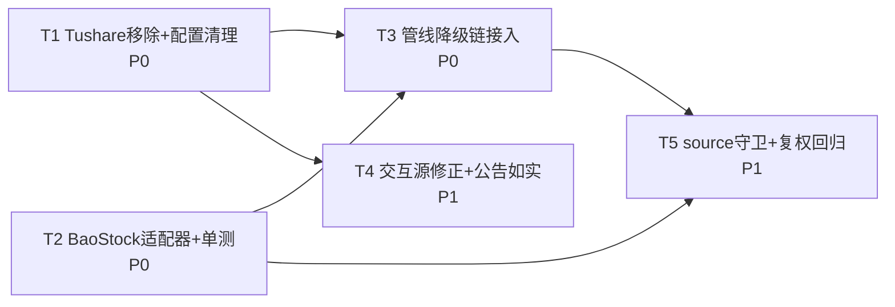

# AQP 多源降级容错 — 增量设计方案（第二阶段，落码前定稿）

- 文档日期：2026-09-26
- 作者：架构师 高见远（software-architect）
- 前置输入：`docs/audit-datasource-2026-09-26/数据源审计报告.md`（第一阶段只读审计，结论已被采纳并独立复核）
- 性质：**设计方案**。本阶段不落码、不改任何业务代码/配置，仅新增本文档一个文件。
- 约束（用户硬性要求）：不重写、不换架构、不改前端、不改 `/api/...` 协议、不伪造数据、**绝对禁止 Tushare**（不 import、不用 Token、不为适配改代码）。

---

## 0. 决策一览（TL;DR）

| # | 决策点 | 最终结论 |
|---|---|---|
| D1 | **股票历史 K 线主源：腾讯 vs 东财** | **东财 `stock_zh_a_hist` 继续做管线主源**。腾讯降级为「交互路径 + 管线兜底」。理由见 §2.1（腾讯丢 `amount`/`turnover`、复权算法不同、逐年循环 N 次请求）。另提供 `AQP_DAILY_SOURCE_PRIORITY` 配置开关，允许用户按原文「腾讯优先」切换（含口径告警）。 |
| D2 | 管线 K 线兜底链 | `东财(stock_zh_a_hist) → 新浪(stock_zh_a_daily) → BaoStock`。BaoStock 仅第三层，**全历史整取**，仅当整只标的的历史都缺失时才用。 |
| D3 | 个股实时快照 `fetch_quote` | `腾讯(qt.gtimg.cn) → 新浪(hq.sinajs.cn)`（**把东财 push2delay 备源换成新浪**）。 |
| D4 | 批量实时 `fetch_quotes_batch` | 维持 `腾讯 → 新浪 → degraded`（已符合要求，不动）。 |
| D5 | ETF | **不接 BaoStock**（实测 0 行，实锤，见 §3.6）。维持 `腾讯 K线 + 新浪目录`。 |
| D6 | 公告源失实 | `fetch_sina_notices` / `ingest/announcements.py` 命名谎报新浪、实为东财 ⇒ **改名 + 注释如实 + 面板标注 source=eastmoney**；不新增伪造的「新浪公告」。 |
| D7 | Tushare | **彻底移除**（代码 + 配置 + 测试），逐处清单见 §2.4。 |
| D8 | 抽象复用 | **不新造框架**：扩源复用 `realtime._first_source` + `akshare_adapter._safe_call`；BaoStock 不走 akshare ⇒ **不走 `_safe_call`**，但**复用 `_throttle` 同一限速域**。 |
| D9 | 无可靠免费源的功能 | 保留现状 + 结构化 `unavailable` + `reason`，**不伪造**（清单见 §2.7）。 |

---

## 1. 开源参考（已联网核实）

> 说明：以下 6 条**均已通过 WebSearch/WebFetch 实际联网核实**（非凭记忆）。每条给出：项目名 | 来源 URL（核实来源） | 它的做法 | 借鉴点落到本项目哪个函数。

| # | 项目名 | 来源 URL | 它的做法 | 借鉴点 → 本项目落点 |
|---|---|---|---|---|
| R1 | **BaoStock 官方** | `baostock.com/baostock/index.php/A股K线数据`（官方站点，http 可达） | `query_history_k_data_plus(code="sh.600000", frequency="d/w/m/5/15/30/60", adjustflag="3"不复权/"2"前复权/"1"后复权)`；**必须先 `login()`、用完 `logout()`**；代码格式 `sh./sz./bj.` + 点号；官方「每日更新」页声明覆盖 **A股 + ETF** 日K与复权因子；有「平台访问规则/IP 限制」页 | 落到 `data/ingest/baostock_adapter.py`（新增）：`login/logout` 会话 + `bs_code()` 代码转换 + `bs_adjust()` adjustflag 映射（详见 §3）。⚠️ 官方称覆盖 ETF，**本机实测为 0 行**（见 §3.6），以实测为准 |
| R2 | **efinance** | `github.com/Micro-sheep/efinance`（README 经搜索快照核实） | 基于东财单一数据源的封装；`common/` 抽公共取数逻辑、四个资产模块（stock/fund/bond/futures）复用；内置 `retry`（默认 3 次）+ `multitasking` 并发 + `tqdm`；`config/` 集中维护东财 f51… 字段映射；`to_numeric` 自动清洗 | **反面参考**：efinance 本身就是「单东财源」⇒ 印证本项目「降东财单点」的必要性。正面借鉴：字段映射集中在 `akshare_adapter._RENAME_DAILY`（已有）、数值清洗集中在 `_standardize_daily`（已有）——**不要在每个源里各写一遍清洗** |
| R3 | **easyquotation** | `github.com/shidenggui/easyquotation`（README 经搜索快照核实） | `easyquotation.use('sina'|'tencent')` 选择源；`BaseQuotation` 抽象基类 + 各源子类；`market_snapshot(prefix=True)` 一次拉全市场；社区示例给出 `for source in sources: try/except 降级` 的 failover 写法 | 落到 `data/realtime.py:143 _first_source`：本项目**已有等价抽象**（按序 try、首个成功即返回、全败抛 `DataSourceUnavailable`），命名与签名保持不变，**只新增源函数，不新造基类** |
| R4 | **adata** | `github.com/1nchaos/adata`（README + DeepWiki 核实；聚合 东财/同花顺/百度/新浪/腾讯） | **多数据源融合自动切换**（Template Method + 每源 Adapter + Facade 统一入口）；`get_market()` 聚合多源、主源失败自动落备源；“Proxy configuration for handling request limitations” | 落到 `data/realtime.py:143 _first_source` 与 `akshare_adapter.fetch_daily_bar:399`：**这就是本项目降级链要复用的范式**。区别：本项目是「显式有序链」而非「score 选源」，更简单可预测，保持 |
| R5 | **microsoft/qlib 数据层** | `github.com/microsoft/qlib` + `qlib.readthedocs.io/en/.../component/data.html`（核实） | 分层 Provider 抽象（`CalendarProvider/InstrumentProvider/FeatureProvider/PITProvider/ExpressionProvider`）+ 本地/远程实现；`.bin` 二进制存储；多级 Cache（MemCache/Disk/Redis）；`DataHandler`+`Processor` 做标准化/去极值/归一化 | 借鉴「**Provider 接口 + 多后端实现**」的清晰分层思想：本项目对应 `akshare_adapter`(Provider) + `parquet_store`(Storage) + `cache/swr`(Cache)。**本项目已有此分层，无需引入 qlib 级复杂度**；仅在新源适配器命名上对齐（`_fetch_daily_bar_em/_sina/_tx/_bs`） |
| R6 | **akshare-stock-data-fetcher** | `github.com/VeKiner/akshare-stock-data-fetcher`（README 核实） | 因 AKShare「无内置频率控制、易 429/封 IP」，用 **代理轮转 + `urllib3.Retry` 对 429/5xx 退避重试 + 无侵入打补丁** | 借鉴「**AKShare 本身缺限速/重试，必须在外层包一层**」：本项目对应 `akshare_adapter._throttle`（全局限速）+ `_safe_call`（tenacity 指数退避）+ `_SourceBreaker`（按接口熔断）——**已有且更完备（含熔断）**；新源同样必须经外层封装，禁止直调 |

**未核实项**：RQData（`rqdata` 多源容错）**未能联网核实**（未纳入检索）。故本文档**不引用**其做法，标注「未核实」，不做推断。

---

## 2. 降级链定稿

### 2.1 ★ 主源取舍判断：腾讯 vs 东财（股票历史 K 线）

**现状**：管线 `akshare_adapter.fetch_daily_bar:399` = 东财 `stock_zh_a_hist`(主) → 新浪 `stock_zh_a_daily`(备)；本机 `push2his.eastmoney.com`（东财**历史**接口）实测**正常**；本地 `daily_bar` 共 **516 万行**、`daily_bar_hfq` 的复权口径由东财 `stock_zh_a_hist(adjust="hfq")` 生成。

**用户原文**：「腾讯优先 → 新浪 → BaoStock」。

**已核实的字段级事实**（读 akshare 包内源码，非推断）：

| 源 | AKShare 函数 | 返回列 | 成交量单位 | 成交额 | 换手率 | 涨跌幅 | 复权算法 | 全历史请求数 |
|---|---|---|---|---|---|---|---|---|
| 东财(现主源) | `stock_zh_a_hist` | date/open/close/high/low/volume/amount/振幅/涨跌幅/涨跌额/换手率 | 手 | ✅ 元 | ✅ % | ✅ | 东财除权因子法 | **1 次**（区间整取） |
| 腾讯 | `stock_zh_a_hist_tx` | date/open/close/high/low/**amount(=实为成交量 手)** | 手 | ❌ **缺失** | ❌ 缺失 | ❌（可由 close 推） | 腾讯自有 qfq/hfq | **N 次**（`for year in range(...)` 逐年循环，源码 `stock_hist_tx.py:53`） |
| 新浪 | `stock_zh_a_daily` | date/open/high/low/close/volume/amount/outstanding_share/turnover | **股**（≠东财 手） | ✅ 元 | ⚠️ 比率(0–1) 非 % | ❌（可推） | 新浪因子法 | 1+2 次（含 2 次因子） |
| BaoStock | `query_history_k_data_plus` | date/open/high/low/close/volume/amount/turn/tradestatus/pctChg/peTTM/pbMRQ/psTTM/pcfNcfTTM/isST | 股 | ✅ 元 | ✅ % | ✅ | **涨跌幅复权法**（与东财/新浪不同） | 1 次 |

**数据口径影响评估**（若把腾讯提到东财之前）：

- **(a) 丢失字段**：
  - `amount`（成交额，元）**彻底丢失**——腾讯返回列里那个叫 `amount` 的列**实为成交量（手）**（见 `stock_hist_tx.py:72` 注释与腾讯 `newfqkline` 协议）。若照搬进 `_standardize_daily`，会把**成交量写进成交额字段**，直接污染 `amount` 列 → 金额类特征/展示全错。
  - `turnover`（换手率）**丢失**。
  - `pct`（涨跌幅）/`amplitude`（振幅）**丢失**（可由 close/prev_close 推，但 `振幅` 无法还原）。
- **(b) 破坏 `daily_bar` 历史一致性与 `repair.build_qfq_dataset`**：
  - `repair.build_qfq_dataset` 用 `qfq = hfq / F_last` 从本地 **raw + hfq** 推导。raw/hfq 来自 `fetch_and_write_daily_bars`（`tasks.py:294`，默认口径 `("", "hfq")`）。
  - 腾讯的复权算法与东财**不同**；若主源切成腾讯，**同一 symbol 在切换日前后两段的 hfq 基准不同** → hfq 序列出现**假的复权因子跳变** → 推导出的 qfq 在同一序列内不可比。这**正是 `tasks.py:301-312` 注释里已经明令禁止的「复权基准漂移」**。
  - `write_daily_bars`（`tasks.py:250`）按 `date` 去重增量合并：腾讯源会把**已有的东财行覆盖**（同一 date 保留新值）→ 存量 516 万行中与增量区间重叠的部分被**静默改写**。
- **(c) 对 1626 条测试基线的影响**：
  - 依赖「东财口径（volume=手、amount=成交额、turnover=%）」的断言（`_RENAME_DAILY` / `_standardize_daily` 相关、`test_multi_source.py`、以及任何校验 `amount`/`turnover` 的用例）会**大面积红**。
  - 腾讯 `stock_zh_a_hist_tx` 逐年循环 ⇒ 单只全历史要发 **十几到几十次** HTTP，在 `AKSHARE_RATE_LIMIT=1.2s` 下，**全市场 5000+ 只**的同步会被放大到不可接受，且显著提高封 IP 概率。

**最终建议（D1）**：**东财继续做管线主源**。把「腾讯优先」诉求落到**交互路径**（实时快照，本就用腾讯）与**兜底链位置**上：`东财 → 新浪 → BaoStock`。理由：东财历史接口（push2his）本机可用、字段最全、口径与 516 万行存量一致、单请求整取性能最好；腾讯作为**管线主源**是**负收益**（丢量额率 + 破口径 + 拖慢 + 提高封禁风险）。

**备选实现（供用户否决时切换，D1-alt）**：
- 新增配置 `AQP_DAILY_SOURCE_PRIORITY`（默认 `"eastmoney,sina,baostock"`）。用户在 `.env` 改为 `"tencent,eastmoney,sina,baostock"` 即启用「腾讯优先」，**无需改代码**。
- 当优先级含 `tencent` 且排在首位时，`fetch_daily_bar` 走腾讯分支，且**适配器必须**：把腾讯列 `amount` **重命名为 `volume`**（因其实为成交量），并把 `amount` **显式置 null**（不伪造）、`turnover/pct` 置 null；同时在日志与数据 `source` 列打 `tencent`，前端若读 `amount`/`turnover` 会得到 null（**已如实降级，非伪造**）。
- 启用该开关时后端启动打印 **WARNING**：提示「腾讯源缺失成交额/换手率，且与本地东财口径不兼容，可能造成复权序列跳变」，需用户自担。

### 2.2 个股实时快照 `fetch_quote`（`data/realtime.py:266`）

- 现状：`[("tencent", fetch_tencent_quote), ("eastmoney", _fetch_em_quote)]`。
- **改为**：`[("tencent", fetch_tencent_quote), ("sina", fetch_sina_quote)]`——新增新浪单只快照函数 `fetch_sina_quote`（可复用 `_fetch_sina_quotes_batch` 的解析逻辑，单只版）；东财 push2delay **降级备源移除**（它是东财，正是要降的对象）。
- 兜底：全败返回既有 `DataSourceUnavailable`（已是标准信封路径）。
- 说明：腾讯快照含 `pe_ttm/pb/换手率/内外盘/市值`，新浪 `hq.sinajs.cn` 单只仅有 `price/open/prev_close/high/low/volume/amount`（**无 PE/PB/换手率**）⇒ 新浪作为备源时这些字段为 null（**如实降级**，前端 `panel.quote.pe_ttm` 允许 null）。

### 2.3 批量实时 `fetch_quotes_batch`（`data/realtime.py:403`）

维持 `腾讯 → 新浪 → degraded`，**不动**（已符合）。仅在文档记录：新浪批量的 `turnover/float_cap_yi/total_cap_yi` 天然为 null（见 `realtime.py:392-395`）。

### 2.4 Tushare 移除（逐处清单，D7）

| 序 | 文件:行 | 现状 | 处置 |
|---|---|---|---|
| 1 | `data/ingest/multi_source.py:1` | docstring「三行情源冗余…AKShare → Tushare Pro → Eastmoney HTTP」 | 改为「多源冗余…AKShare(内含新浪兜底) → Eastmoney HTTP」 |
| 2 | `data/ingest/multi_source.py:7` | `- Tushare：HTTP 直连 pro API（…TUSHARE_TOKEN…）` | **删除该行** |
| 3 | `data/ingest/multi_source.py:22` | `_TUSHARE_URL = "http://api.tushare.cn"` | **删除** |
| 4 | `data/ingest/multi_source.py:57-63` | `_tushare_ts_code()` | **删除** |
| 5 | `data/ingest/multi_source.py:65-92` | `_from_tushare()`（含 `get_settings().TUSHARE_TOKEN`、`httpx.post`） | **删除整函数** |
| 6 | `data/ingest/multi_source.py:129-133` | `SOURCES = [("akshare",…), ("tushare",_from_tushare), ("eastmoney",…)]` | **移除 `("tushare", _from_tushare)` 项**；链条变为 `akshare → eastmoney`（如需 BaoStock，见 §5 的整合建议） |
| 7 | `core/config.py:221-222` | `# ---- 数据源（P1-2 三源冗余）----` + `TUSHARE_TOKEN: str \| None = Field(...)` | **删除字段与注释块** |
| 8 | `tests/test_multi_source.py:53-67` | `test_fallback_chain` 断言降级到 `tushare` | **改写为降级到 `eastmoney`**（断言 `source=="eastmoney"`、`called==["akshare","eastmoney"]`）；`test_fallback_to_eastmoney`（69-82）随之调整；`test_all_sources_fail_raises`（85-90）仍成立 |
| 9 | `tests/test_p3_security.py:14` | `SAFE_PATTERNS` 含 `"TUSHARE_TOKEN"` | **删除该字符串**（密钥扫描白名单项，删除字段后成为死项；删除是卫生性清理，非功能必需） |

**动态引用核查（删除前必做，已完成）**：全仓 `grep -rn "fetch_daily_bar_multi\|multi_source\|TUSHARE\|_from_tushare" backend --include=*.py`（排除 `.venv`/`logs`）结果 = **仅 `tests/test_multi_source.py` 引用 `multi_source`/`fetch_daily_bar_multi`**；未发现 `getattr(...)`/`importlib`/字符串拼接式的**动态**引用（`tests/test_domain_purity.py:111`、`test_dead_code_removed.py:26`、`test_data_prep.py:323`、`test_overview_heal_chain.py:43`、`test_query_limit_bounds.py:55` 的 `importlib.import_module` 均指向**其它**模块）。⇒ **`fetch_daily_bar_multi` 无任何生产调用方。**

**`fetch_daily_bar_multi` 是否保留**：**保留**（避免删公开符号引发未知回归；且它是可测的多源示例），但：
- 从 `SOURCES` 移除 tushare；
- 若要把它接成「真正有用的多源」，把 `_from_akshare`（=`fetch_daily_bar`，已内含 东财→新浪）作为首源、`baostock` 作为次源、`eastmoney` HTTP 作为末源 → 链条 `akshare(东财→新浪) → baostock → eastmoney`。**但生产管线不走它**（管线走 `fetch_and_write_daily_bars → akshare_adapter.fetch_daily_bar`），故 BaoStock 的**有效接入点是 `fetch_daily_bar` 内部**（见 §5-T2），而非 `multi_source`。

### 2.5 公告源失实修正（D6）

- `data/realtime.py:601 fetch_sina_notices`：函数名/docstring 称「新浪」，实际 `_ak().stock_notice_report` 底层为 **东财** `np-anotice-stock.eastmoney.com`（审计已独立复核）。
- `data/ingest/announcements.py:38 fetch_announcements`：docstring「sina 公告接口」同属失实。
- **修正方案（择一，推荐 A）**：
  - **A（改名 + 如实标注）**：`fetch_sina_notices → fetch_em_notices`；注释改为「东方财富公告（`stock_notice_report`），**非新浪**」；返回 `source` 由 `"sina"` 改为 `"eastmoney"`。面板 `events` 块据 `source` 披露真实来源。**风险最低，不动数据链路**。
  - **B（换真非东财源）**：改用巨潮 `stock_zh_a_disclosure_report_cninfo`（已在 `fetch_cninfo_announcements:572` 使用，非东财）作为主，东财公告作兜底。代价：巨潮需按代码查、字段/时效不同，需重测。
- 明确保留：`fetch_cninfo_announcements`（巨潮，非东财）与本地 `data/announcements.py`（读 parquet，天然免疫）不动。

### 2.6 复用契约（硬性，D8）

1. 所有**新增交互源**（新浪单只快照等）必须经 **`data/realtime.py:143 _first_source`**；新增源函数签名为 `(symbol) -> dict`。
2. 所有 **AKShare 源**必须经 **`akshare_adapter._safe_call:237`**（含 `_throttle` 全局限速 + tenacity 退避 + `_SourceBreaker` 按接口熔断）；**禁止自建重试循环**（`market_service` 头部注释已明令「不再自建重试包装绕过全局限速」）。
3. **BaoStock 不走 akshare ⇒ 不能套 `_safe_call`**（它针对 `ak.*` 函数做熔断键/重试）。BaoStock 该**复用 `akshare_adapter._throttle`**（同一外部限速域，见 §3.5），**不复用** `_safe_call`/`_SourceBreaker`（其熔断键基于 akshare 函数对象，对 baostock 无意义）。
4. **禁止裸 `except: pass`**。每次失败至少记录结构：`{source, api, params, error, ts}`（见 §3.5 日志格式）。
5. 全链路失败**必须**返回项目**标准错误信封**（HTTP 恒 200 + 业务非零 code）：抛 `core.errors.DataSourceUnavailable`（→ `ERR_DATA_SOURCE=51000`，`errors.py:137/97`）或由 API 层返回 `{status:"unavailable", reason}`；**禁止裸 500**。现有 `ok/fail/APIResponse`（`errors.py:57/62/43`）与全局 handler（`register_error_handlers`）已完成转换，新代码沿用即可。

### 2.7 无可靠免费源的功能（保留现状 + 结构化 unavailable，不伪造）

个股/大盘/ETF 资金流、北向资金/持股（已永久下线）、股东户数与十大流通股东、ETF 行业配置/费率/公告/持仓、行业板块资金结构、乐咕乐股估值。⇒ 维持 `status:"unavailable"` + `reason` + `source`，**不用成交额等近似量冒充资金流**。

---

## 3. BaoStock 集成规格（D2 / D5）

> 依据：团队实测（`baostock 0.9.4` 已装入 `backend/.venv`；探针 `C:/Users/HY/AppData/Local/Temp/aqp_baostock_probe.py`）+ 官方文档（R1）。

### 3.1 懒加载 import（未安装不得影响启动）
- 新增 `data/ingest/baostock_adapter.py`，模块级 `_bs_module: ModuleType | None`，首次调用才 `import baostock`（**完全对齐 `akshare_adapter._ak:44` 的惰性模式**）。
- `is_available() -> bool`：try `import baostock`，捕获 `ImportError` 返回 False。**未安装时该源标记 `absent`**，`fetch_daily_bar` 直接跳过它（不等价于失败，**不计数、不报错、不进降级失败日志**）。
- 后端**启动路径不得 import baostock**（与 akshare 同理），保证未装 baostock 时服务照常起。

### 3.2 进程级会话管理（login/logout）
- 实测：`bs.login()` **无需注册/token/手机号**，`err_code=0`；`logout()` 可用。
- 规格：模块级 `_session_lock`（`threading.Lock`）+ `_logged_in: bool`；`_ensure_login()`：若未登录则 `login()`，`error_code != "0"` 抛 `DataSourceUnavailable`（**登录失败按源不可用处理，换下一个源**）；`logout()` 在 `atexit` 注册 + 显式幂等封装（重复调用安全）。
- **幂等 & 异常安全**：`_ensure_login` 可重入（锁保护）；**首批连接失败不缓存**（下次重试），成功后才置 `_logged_in=True`。

### 3.3 代码转换（含北交所 guard）
- `bs_code(code6) -> str`：
  - `6`/`9`/`5` 开头 → `sh.`（沪市股票/ETF/B股）
  - `0`/`2`/`3` 开头 → `sz.`（深市）
  - `4`/`8` 开头（新三板/北交所）→ **guard：直接抛 `ValueError` 或返回 sentinel 标记「不支持」**，**不发请求**。
- ⚠️ **北交所硬约束**：实测 `bj.430047` 会**成功调用但报错 `10004011 股票代码未标识sh或sz`，且该失败路径耗时 39.35 秒**。⇒ **必须在调用前 guard 掉北交所代码**（前缀 `4`/`8`），否则单只标的会拖垮整批。
- 复用现成转换：可参考 `akshare_adapter._sina_symbol:314` 的前缀判定逻辑（同构），但 baostock 用点号 `sh.600519`，注意与新浪 `sh600519` 的区别。

### 3.4 adjustflag 映射 + 字段标准化
- 映射 `{"": "3", "qfq": "2", "hfq": "1"}`（实测 3/2/1 全部可用且数值合理：前复权 1531.22 vs 不复权 1685.01）。
- `query_history_k_data_plus(code, fields=..., start_date, end_date, frequency="d", adjustflag=...)`；周/月 K：`frequency="w"/"m"`（实测可用）。
- `fields` 建议：`date,open,high,low,close,volume,amount,turn,pctChg`（**turn/pctChg/amount/volume 实测全部有值**）。
- **字段标准化到 `_standardize_daily` 的 schema**：`open/high/low/close` 直取；`volume` **股 → 手**（÷100，与东财 `volume=手` 对齐）；`amount` 直取（元）；`turn→turnover`（%，与东财 % 一致）；`pctChg→pct`（%）；补 `date/symbol/code/source/amplitude(null)/change(null)`。
- ⚠️ **所有返回值都是字符串**（如 `'0.240900'`），必须 `pd.to_numeric(errors="coerce")`。
- ⚠️ **复权口径告警**：BaoStock 用**涨跌幅复权法**，与东财/新浪**不同**。⇒ **硬规则：BaoStock 只允许整段历史换取**（`source==baostock` 的行**不得与**东财/新浪行在同一条 hfq/qfq 序列内混用）。落码时在 `write_daily_bars`/`fetch_and_write_daily_bars` 加 **source 一致性守卫**：若目标数据集已有不同 `source` 的行，且新行为 `baostock`，则**仅填充缺失日期、不覆盖既有行**（或直接拒绝并披露）。这是**防止复权因子跳变**的关键安全阀。

### 3.5 限速域与日志格式（D8）
- **是否纳入 `AKSHARE_RATE_LIMIT` 同一限速域**：**建议纳入**。理由：BaoStock 实测 **平均 3.18s/次**（首次 4.0s），是**慢源**；若独立限速，会与东财/新浪并发形成叠加压力。复用 `akshare_adapter._throttle`（其实现只依赖 `AKSHARE_RATE_LIMIT` 全局间隔 + jitter，与「哪个源」无关）即可把 BaoStock 纳入**同一外部请求节流**。若担心语义混淆，可**另加** `BAOSTOCK_RATE_LIMIT` 并在 `_throttle` 内取 `max(akshare, baostock)`——但最小改动方案是**直接复用 `_throttle`**。
- **不进热路径**：BaoStock 3.2s/次 ⇒ **只做管线兜底（离线/夜间同步）**，**不得**用于实时快照、不得用于 `overview/rt` 并行预热。
- **失败日志格式**（禁止裸 `except: pass`）：
  ```
  logger.warning(
    "[baostock] fetch_daily_bar 失败 | source=baostock | api=query_history_k_data_plus "
    f"| code={code} start={start} end={end} adjust={adjust} "
    f"| error={type(e).__name__}: {e!r} | ts={datetime.now().isoformat(timespec='seconds')}"
  )
  ```
  并在 `_first_source`/`fetch_daily_bar` 的 `errs` 聚合中保留 `source:ExcType`（现有格式，见 `realtime.py:151`）。

### 3.6 ETF / 指数 边界（实测实锤）
- **ETF 明确排除**：实测 `sh.510300`/`sz.159915`/`sh.518880` **全部 0 行**（前复权亦 0 行）。⇒ **ETF 不接 BaoStock**，维持 `腾讯 K线 + 新浪目录`（D5）。官方「每日更新」页虽称覆盖 ETF，但**以本机实测为准**：历史 `query_history_k_data_plus` 对 ETF 无效。
- **指数**：实测 `sh.000300` **可用**（38 行）。可作为指数日线的**额外兜底**，但**优先级最低**（现有新浪 `stock_zh_index_daily` + 腾讯已够）。

---

## 4. 统一输出适配层

所有新增源（新浪单只快照、BaoStock）转换到项目**现有格式**，字段名**以现结构为准**，**不新增前端字段、不改前端结构**：
- K 线：`date/open/high/low/close/volume/amount/symbol/code/source`（对齐 `_standardize_daily:282` 与 `multi_source._standardize:29`）。可选 `pct/turnover/amplitude/change`。
- 快照：对齐 `realtime.fetch_tencent_quote:179` 的 dict 键（`price/prev_close/pct/turnover/outer_vol/inner_vol/float_cap_yi/total_cap_yi/pe_ttm/pb/quote_time/source`）；缺失字段填 `null`，**不补零、不估算**。
- 单位约定（务必与存量一致）：`close/open/...=元`，`volume=手`，`amount=元`，`pct/turnover=百分比`，`*_cap_yi=亿元`。

---

## 5. 文件清单 + 依赖图 + 有序任务列表

### 5.1 文件清单（相对路径）

| 文件 | 动作 | 改什么/加什么 |
|---|---|---|
| `backend/app/data/ingest/baostock_adapter.py` | **新增** | 懒加载 import、`is_available()`、`_ensure_login/_logout` 幂等会话、`bs_code()`（含北交所 guard）、`bs_adjust()`、`fetch_daily_bar_bs()`（标准化到 `_standardize_daily` schema）、失败日志 |
| `backend/app/data/ingest/akshare_adapter.py` | 改 | `fetch_daily_bar:399` 增加第三层 BaoStock（`东财→新浪→BaoStock`，BaoStock 仅当 `is_available()` 且前两源失败）；`fetch_daily_bar` 支持读取 `AQP_DAILY_SOURCE_PRIORITY`（D1-alt）；新增腾讯分支 `_fetch_daily_bar_tx`（仅在优先级含 tencent 时用，列 `amount`→`volume`、`amount=null`） |
| `backend/app/data/realtime.py` | 改 | `fetch_quote:266` 备源由东财改新浪（+新增 `fetch_sina_quote`）；`fetch_sina_notices:601 → fetch_em_notices`（改名+注释如实+`source="eastmoney"`）；`_first_source:143` 日志增强（可选） |
| `backend/app/data/ingest/announcements.py` | 改 | docstring「sina 公告接口」→「东方财富公告」；`source` 值改 `eastmoney` |
| `backend/app/data/ingest/multi_source.py` | 改 | 移除 tushare（§2.4 逐处）；docstring 修正；`SOURCES` 去 tushare |
| `backend/app/core/config.py` | 改 | 删 `TUSHARE_TOKEN:222`；新增 `AQP_DAILY_SOURCE_PRIORITY: str = "eastmoney,sina,baostock"`（+可选 `BAOSTOCK_RATE_LIMIT`） |
| `backend/tests/test_multi_source.py` | 改 | 断言去 tushare，改 eastmoney（§2.4 第 8 项） |
| `backend/tests/test_p3_security.py` | 改 | 白名单去 `TUSHARE_TOKEN`（§2.4 第 9 项） |
| `backend/tests/test_baostock_adapter.py` | **新增** | BaoStock 适配器单测（未安装/登录失败/北交所 guard/字段标准化/复权映射），**全部 monkeypatch，不发真实网络** |
| `backend/tests/test_datasource_failover.py` | **新增** | 降级链/契约测试（§7 测试矩阵） |
| `docs/audit-datasource-2026-09-26/增量设计方案.md` | 本次新增 | 本文件 |

### 5.2 有序任务列表（按实现顺序；每任务 ≤5 文件组）

| Task | 名称 | 源文件 | 依赖 | 优先级 |
|---|---|---|---|---|
| **T1** | **Tushare 彻底移除 + 配置清理** | `multi_source.py`、`core/config.py`、`tests/test_multi_source.py`、`tests/test_p3_security.py` | — | **P0** |
| **T2** | **BaoStock 适配器（新模块）+ 单测** | `data/ingest/baostock_adapter.py`(新)、`tests/test_baostock_adapter.py`(新) | — | **P0** |
| **T3** | **接入管线降级链（东财→新浪→BaoStock）+ 主源开关** | `akshare_adapter.py`（`fetch_daily_bar`）、`core/config.py`（`AQP_DAILY_SOURCE_PRIORITY`） | T1、T2 | **P0** |
| **T4** | **交互源修正 + 公告如实 + 契约测试** | `realtime.py`（fetch_quote 备源改新浪、`fetch_sina_quote` 新增、`fetch_sina_notices` 改名）、`ingest/announcements.py`、`tests/test_datasource_failover.py`(新) | T1 | **P1** |
| **T5** | **source 一致性守卫 + 复权口径回归 + 前端契约核验** | `data/ingest/tasks.py`（`write_daily_bars`/`fetch_and_write_daily_bars` 加 source 守卫）、回归脚本、契约核验清单 | T2、T3 | **P1** |

> 说明：T1/T2 相互独立可并行；T3 依赖两者；T4 只依赖 T1；T5 收口风险。**全部禁止改前端**。

### 5.3 任务依赖图



### 5.4 共享知识（跨文件约定）
- 单位口径：`volume=手`、`amount=元`、`pct/turnover=%`、`*_cap_yi=亿元`、`date=YYYY-MM-DD`。
- 数据源标识：新增行 `source ∈ {eastmoney, sina, tencent, baostock}`；随响应/数据回传，前端据 `source` 披露。
- 降级统一抛 `DataSourceUnavailable`（→ `code=51000`）；块级降级返回 `{status, reason, source, from_cache?}`。
- 配置项：`AQP_DAILY_SOURCE_PRIORITY`（默认 `eastmoney,sina,baostock`）；BaoStock 复用 `AKSHARE_RATE_LIMIT` 限速域。
- 禁止：`import tushare`、裸 `except: pass`、自建重试、为算指标再打外部接口。

### 5.5 待明确事项
1. `AQP_DAILY_SOURCE_PRIORITY` 是否真的开放给用户切换（还是仅内部保留默认）？
2. BaoStock 是否可作为**指数**日线的额外兜底（实测可用，但优先级最低）？
3. 公告方案选 A（改名如实）还是 B（换巨潮）？
4. BaoStock 与东财 hfq 混列时的守卫策略：**仅填缺失日期** vs **整只标的重取**（见 §3.4/§6-风险）。

---

## 6. 风险与回滚

| # | 改动 | 风险 | 回滚方式 |
|---|---|---|---|
| R1 | Tushare 移除 | 若有未知动态引用则 ImportError | 提交粒度独立（T1 单独 commit）；`git revert` 即可；**已静态核查无动态引用** |
| R2 | BaoStock 接入管线 | 复权口径混列 → hfq/qfq 跳变 | 默认优先级把 baostock 放**最后**；`write_daily_bars` 加 source 守卫（T5）防覆盖；开关可一键关闭（优先级去掉 baostock） |
| R3 | BaoStock 未安装 | 理论上 import 失败 | 懒加载 + `is_available()` ⇒ 标记 absent，**不影响启动**；单测覆盖 |
| R4 | BaoStock 登录失败/超时 | 拖慢管线 | 登录失败即换源；北交所 guard 防 39s 卡顿；仅兜底不进热路径 |
| R5 | fetch_quote 备源换新浪 | 新浪缺 PE/PB/换手率 | 缺失字段 `null`（前端已容忍）；腾讯主源覆盖绝大多数请求 |
| R6 | 公告改名 | 调用方引用旧名 | 统一 grep `fetch_sina_notices` 全量替换；保留别名 `fetch_sina_notices = fetch_em_notices` 过渡（可选） |
| R7 | 配置新增字段 | 旧 Settings 替身缺字段 | 用 `getattr(get_settings(), "AQP_DAILY_SOURCE_PRIORITY", "eastmoney,sina,baostock")` 兜底（对齐 `_breaker_enabled` 模式） |

### 6.1 前端契约零变化证明（必须不变的字段，逐端点）
> 基线来源：审计报告 §6 与 `frontend/src/types/*.ts`。**任何改动的验收标准 = 以下字段名/类型/枚举值完全不变。**

| 端点 | 必须不变的字段 |
|---|---|
| `GET /api/v1/stock/{symbol}/kline` | `bars[]{date,open,high,low,close,volume,amount}` + `ma_5/10/20/60/120/250, macd_dif/dea/bar, rsi_14, boll_mid/up/low` |
| `GET /api/v1/stock/{symbol}/panels` | 每块 `{status:'ok'\|'degraded'\|'unavailable', reason?, from_cache?}`；`quote{price,pct,turnover,total_cap_yi,float_cap_yi,outer_vol,inner_vol,outer_ratio,inner_ratio,quote_time,source}`；`money_flow{date,main_net,main_net_yi,main_net_ratio,super_large_net_yi,large_net_yi,medium_net_yi,small_net_yi,source}`；`north{date,hold_shares,hold_cap_yi,pct_of_float,source}`；`fundamentals{pe_ttm,pb,roe,gross_margin,net_margin,eps,bps,revenue_yi,net_profit_yi,report_date,note}`；`events{items[]{title,date,url,source,event_type,sentiment}}`；`holders`；`chip`；`risk` |
| `GET /api/v1/market/overview/rt`(+`/overview`,`/overview/daily`) | `indices,heat{up,down,flat,limit_up,limit_down,total_amount_yi,buckets{b1..b9},source('em'\|'local'),note},money_flow{north_net_today,main_net_today,sector_flows[]{name,main_yi,retail_yi,total_yi}},sectors,anomalies,recommend,ai_stats,sentiment`；每块 `{status,reason?,message?,as_of?,coverage?,freshness?}` |
| `GET /api/v1/screener` | 顶层 `status:'ok'\|'degraded'\|'unavailable'`,`reason`,`message`,`coverage{available,total,ratio}`,`freshness{...}`,`universe_filter{...}`；`items[]{symbol,name,industry,close,pct,turnover,amount,limit_pct,score,signal_strength('strong'\|'neutral'\|'weak')}`；`stats.today{total,pool_size,win_rate,avg_pct,avg_score,strong_signal,industry_count,top_industry_ratio}` |
| `GET /api/v1/screener/stocks` | `STOCK_ROW_FIELDS` **顺序即前端列顺序**：`symbol,name,industry,board,close,pct,amount,amount_yi,total_cap_yi,float_cap_yi,turnover,is_st,is_halted,quote_status('ok'\|'halted'\|'missing')`；顶层 `{rows,trade_date,as_of,basis('auto'\|'realtime'\|'daily'),source,degraded,quote_coverage,basis_desc,basis_fields}` |
| `GET /api/v1/watchlist/dashboard` | `summary{count,stock_count,etf_count,avg_pct,flow_total_yi,flow_status,alert_count,alert_kinds,quote_date}`；`items[]{symbol,code,type('etf'\|'stock'),name,close,pct,amount_yi,kline_state,alert,date,closes[],source,pe,pb}` |
| `GET /api/v1/etf/overview\|list\|hot\|flow\|performance\|scale\|detail/{code}` | `detail.blocks{header,kline,holdings,tracking,valuation,flow,news,sentiment,chain}` 每块 `status:'ok'\|'degraded'\|'unavailable'`；`list[]{code,name,country,exchange,type,board,tracking_index,manager,inception,price,pct,amount,size_yi,quote_status,overseas}` |

**核验方法**：改动前后各跑一次本地 API、对上述字段做 schema diff（键集合 + 类型 + 枚举值），diff 为空即契约零变化。

---

## 7. 测试矩阵

| 场景 | 用例 | 断言要点 | 网络 |
|---|---|---|---|
| 股票实时 | `fetch_quote` 腾讯可用 | `source=="tencent"`；字段齐全 | mock |
| 股票实时（备源） | 腾讯失败→新浪 | `source=="sina"`；`pe_ttm/pb/turnover is null` | mock |
| 股票实时（全败） | 腾讯+新浪均失败 | 抛 `DataSourceUnavailable`（非裸异常） | mock |
| 股票日K | `fetch_daily_bar` 东财可用 | 走东财；`amount/turnover` 有值 | mock |
| 股票日K（备源） | 东财失败→新浪 | `source=akshare`；不崩 | mock |
| 股票日K（BaoStock 兜底） | 东财+新浪失败→BaoStock 可用 | 标准化字段正确；`volume` 股→手；`source=="baostock"` | mock |
| 股票周K/月K | BaoStock `frequency=w/m` | 行数与日K量级合理 | mock |
| 股票历史口径一致性 | 东财 hfq 与 BaoStock hfq **不混列** | source 守卫触发，仅填缺失/拒绝 | mock |
| 技术指标 | `enrich_kline`（由 kline 端点触发） | MA/MACD/RSI/BOLL 字段存在；**无额外外呼** | mock |
| ETF 行情/日K/历史 | `etf.fetch_kline`（腾讯）、`fetch_cn_etfs`（东财→新浪） | 字段齐全；**不出现 baostock 调用** | mock |
| ETF 技术指标 | `_build_tracking_block` | 基于腾讯 K 线本地算 | mock |
| 资金流向（东财不可用） | `fetch_main_fund_flow` / `market_service` 资金块 | ⚠️ **回答：东财不可用时资金流向受影响**——`fetch_main_fund_flow` 两 host 均东财⇒全败⇒`unavailable`；`stock_market_fund_flow`/`stock_sector_fund_flow_rank` 同⇒该子块 `degraded`；**不伪装、不填数** | mock |
| 边界：BaoStock 未安装 | 移除/藏 baostock | `is_available()==False`；后端**正常启动**；管线走东财→新浪 | 无 |
| 边界：BaoStock 登录失败 | `login()` 返回非 0 | 抛 `DataSourceUnavailable`；换下一个源；不缓存坏会话 | mock |
| 边界：北交所代码 | `bs_code("430047")` | **不发请求**、快速返回「不支持」；**不出现 39s 卡顿** | 无 |
| 边界：前序源全失败 | 东财+新浪+BaoStock 全失败 | 抛 `DataSourceUnavailable`；API 层返回 `code=51000` 信封（HTTP 200） | mock |
| 边界：复权口径一致性 | same symbol 不同 source | 守卫拒绝覆盖既有行 / 仅填缺失 | mock |
| Tushare 残留 | `grep tushare backend/app` | **0 命中**；`config.TUSHARE_TOKEN` 不存在 | 无 |

---

## 8. 待用户拍板事项
1. **主源**：采纳「东财继续做管线主源、腾讯做交互+兜底」（推荐），还是坚持「腾讯优先」（走 `AQP_DAILY_SOURCE_PRIORITY` 开关，自担口径风险）？
2. **公告方案**：A 改名如实（推荐，风险最低）还是 B 换巨潮？
3. **BaoStock 混列守卫**：仅填缺失日期 vs 整只重取？
4. 是否开放 `AQP_DAILY_SOURCE_PRIORITY` 给最终用户（还是仅内部默认）？
